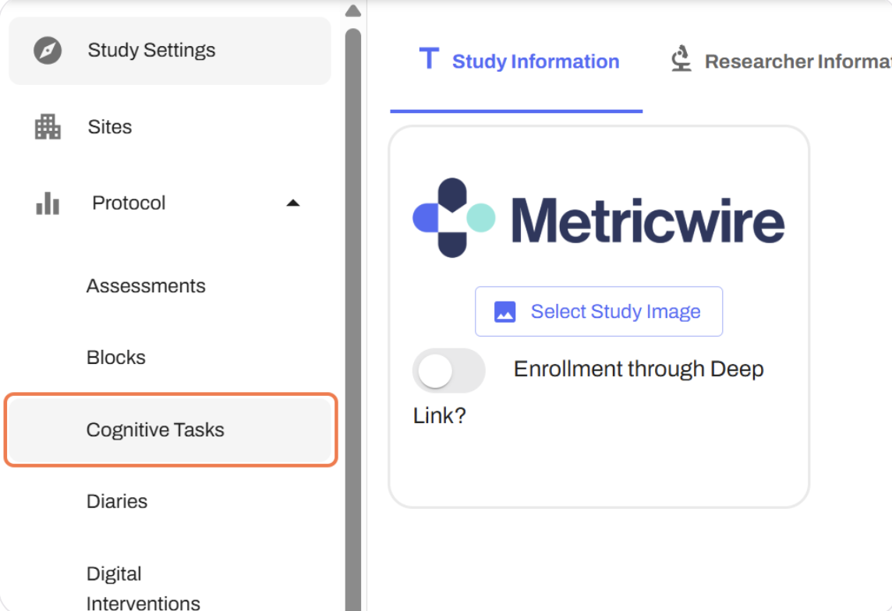
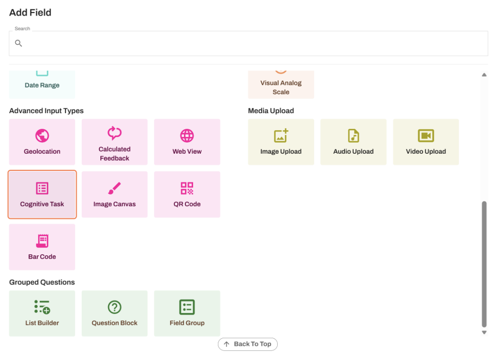

# About this Repository
This documentation page contains an implementation guide for using EMBEDDED cognitive tasks in Metricwire. Using embedded cognitive tasks allows data to be stored directly into the metricwire platform and they do not need connectivity. 

Please note that only FOUR of the cognitive tasks have been validated for use: Color Dots, Color Shapes, Grid Memory, and Symbol Search.
*Note: Photos may not be completely accurate due to constant changes to platform. (Current photos from May 2025)

Getting Started - Using the M2C2kit Production Server

  1. Login to Metricwire Catalyst | [https://catalyst.metricwire.com/](https://catalyst.metricwire.com/)
  
  2. Click on 'Protocol'

  
  3. Click on 'Cognitive Tasks'

  
  4. Click on the blue plus sign in the top right corner

  
  5. Type the name of the cognitive task (e.g., Symbol Search)

  
  6. Click on portrait mode to lock orientation for assessment

  
  7. Click on 'Save Cognitive Task'

  
  8. Click on 'Manage Cognitive Task'

  9. Under templates, select the cognitive task you wish to use

  10.  If you want default parameters and number of trials, select 'Run Code' and move to Step 13

Here are the defaults/recommendation for the number of trials:

  - Color Dots: number_of_trials = 5
 
  - Grid Memory: number_of_trials = 4

  - Symbol Search: number_of_trials = 20

  - Color Shapes:  number_of_trials = 12
    
  *For Color Shapes ONLY: The default is set at 500 ms, but for older adults with suspected impairments or elevated dementia risk, it is suggested to make this 2000 ms. If you would like to change this, please go to step 11.
  
    
  11. If you would like to change the parameters/defaults, click on 'Source Code' to the right of 'Run Code'

*Note. This only needs to be clicked on if you are changing the number of trials or any other parameters. If you need assistance, please reach out to us.*

Here, you can change the number of trials you wish to use for the cognitive task - locate "number_of_trials" within the source code
  
  *For Color Shapes, you also HAVE to update "number_of_different_colors_trials" and can also update "shapes_presented_duration_ms"
  
 IMPORTANT:  The suggested default number of trials is 12. The number of trials MUST be an EVEN number. The number_of_different_colors_trials should be ½ the total number of trials (e.g., if number_of_trials = 20, then the number_of_different_colors_trials = 10). Please make sure to also update this parameter.
The number_of_different_colors_trials parameter is the number of trials where the shapes will change colors from the study phase to the test phase, where the correct answer chosen would be “Different.” The suggested default is 6 for this parameter to coincide with ½ of the number of default trials, which is 12.
The shapes_presented_duration_ms parameter is how long the shapes are shown in milliseconds. The default is 500 ms, but for older adults with suspected impairments or elevated dementia risk, it is suggested to make this 2000 ms.

12. Click on 'Run Code'

13. Do a trial run of the cognitive task all the way to the end with *ALL* trials completed

14. Click on 'Save Task'

15. Click on 'Publish Task'

16. Click on 'Publish Cognitive Task'

17. Click on your study on the top

18. Click on 'Protocol'

19. Click on 'Assessments'

20. Click the assessment you want the cognitive task to appear in

22. Click on 'Fields'

23. Click the blue plus sign in the top right corner to add your cognitive task field

24. Click on 'Cognitive Task' under advanced input types

25. Type label (e.g., Symbol Search)

26. Click on 'Data Coding'

27. Name your variable based on the cognitive task you are using (e.g., symbol_search)

28. Under "Cognitive Task Settings", click on the cognitive task (e.g., Symbol Search) to select the cognitive task

29. Click the green button in the top right corner to save changes

30. Click the two arrows in the top right corner to sync mobile studies with current changes

